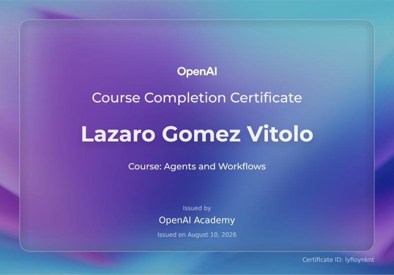

<div align="center">

# OpenAI Academy — Agents and Workflows
### Course Completion Certificate
OpenAI Academy Agents and Workflows course completion certificate and professional credential record.


[](https://academy.openai.com/)
[](https://academy.openai.com/public/courses/agents-and-workflows-bieml)


</div>

---

## Overview

This repository documents the successful completion of **Agents and Workflows**, a course offered through **OpenAI Academy**, completed by **Lazaro Gomez Vitolo**. It is maintained as part of a professional AI & Robotics Developer portfolio and serves as a verifiable, permanent record of applied knowledge in directing and supervising AI-agent-driven workflows.

## Certificate

<div align="center">
  
</div>

## Certificate Details

| Field | Detail |
|---|---|
| **Course** | Agents and Workflows |
| **Provider** | OpenAI Academy |
| **Certificate Holder** | Lazaro Gomez Vitolo |
| **Issue Date** | August 10, 2026 |
| **Certificate ID** | `lyfioynknt` |

## About the Course

**Agents and Workflows** is the most advanced course in OpenAI Academy's core learning pathway, following *AI Foundations* and *Applied AI Foundations*. Developed by teams across OpenAI's product, research, and safety organizations, it moves learners beyond individual prompting into **directing AI agents across structured, multi-step tasks**.

The course is built around applied, workplace-relevant practice rather than model research or engineering theory. Learners work through real task scenarios to build judgment around when and how to delegate work to an AI agent — and when human oversight should remain in the loop.

Core practice areas include:

- Providing an agent with sufficient context to act reliably
- Defining clear, well-scoped outputs and explicit boundaries
- Reviewing, validating, and refining agent-produced results
- Identifying decision points where human judgment is required
- Converting successful one-off interactions into **reusable, repeatable workflows**

This reflects a broader shift in applied AI engineering: from ad-hoc prompting toward structured, auditable, and repeatable agent-assisted processes — a skill set increasingly relevant to engineering, product, and automation roles working with autonomous or semi-autonomous AI systems.

## Skills & Topics Covered

- Directing and supervising AI agents across structured, multi-step tasks
- Context engineering — providing agents with relevant, sufficient input
- Defining task boundaries, constraints, and expected outputs
- Reviewing, validating, and iterating on agent-generated results
- Human-in-the-loop design for agent-assisted workflows
- Building reusable, repeatable agentic workflow patterns
- Applied, workplace-oriented AI adoption practices

## Practical Examples

This repository includes small, educational examples under [`examples/`](examples/) that complement the certificate by demonstrating practical application of agent-workflow and human-in-the-loop concepts covered in the course.

- **[`examples/agent_workflow/`](examples/agent_workflow/)** — a single-agent workflow showing objective definition, context, constraints, execution, validation, and structured output.
- **[`examples/human_in_the_loop/`](examples/human_in_the_loop/)** — a workflow that pauses for human approval before a sensitive action, using the Agents SDK's built-in approval mechanism.

Both are educational/portfolio demonstrations built with the [OpenAI Agents SDK](https://openai.github.io/openai-agents-python/) — **not official OpenAI implementations.** Each example has its own README with setup instructions and expected output.

## Certificate Verification

| | |
|---|---|
| **Certificate ID** | `lyfioynknt` |
| **Issuing Platform** | OpenAI Academy (certificate infrastructure powered by Gradual) |
| **Certificate Page** | [academy.openai.com/public/certificate/lyfioynknt](https://academy.openai.com/public/certificate/lyfioynknt) |

OpenAI Academy issues each eligible course-completion certificate with a unique ID and a shareable public certificate page hosted on its platform. The Certificate ID above is the authoritative reference for this credential and can be used to cross-check the certificate shown in this repository.

> **Note:** Course-completion certificates issued by OpenAI Academy confirm that a learner completed an eligible Academy course. They are distinct from formal **OpenAI Certifications** and do not, on their own, constitute a proctored or assessed professional certification.

## About This Repository

This repository is intentionally lightweight: the certificate and its documentation remain the primary content, complemented by a small set of self-contained, optional example scripts. There is no build step, and the examples add a single well-justified dependency (`openai-agents`) rather than a full application stack.

```
openai-agents-and-workflows-certificate/
├── README.md
├── NOTICE
├── .gitignore
├── certificate/
│   └── openai-agents-and-workflows.png
└── examples/
    ├── agent_workflow/
    │   ├── README.md
    │   └── workflow.py
    └── human_in_the_loop/
        ├── README.md
        └── workflow.py
```
## Author

**Lazaro Gomez Vitolo**
GitHub: [@Lazaro549](https://github.com/Lazaro549)

---

<div align="center">
<sub>The certificate design, branding, and credential are the property of OpenAI / OpenAI Academy. This repository is maintained independently by the certificate holder for documentation and portfolio purposes only.</sub>
</div>
